# DevOps Learning Environment - Complete! 🎉

## Summary

**Status**: ✅ 100% Complete - Full DevOps Curriculum!

**Coverage**:
- ✅ **12 Topics** covered comprehensively
- ✅ **9 Documents** (300+ pages total)
- ✅ **5 Workflows** with hands-on exercises
- ✅ **Beginner to Expert** progression
- ✅ **Production-ready** examples

---

## 📁 Complete Materials Breakdown

### **Phase 1: Fundamentals** (3 Topics)

#### 1️⃣ **Linux Environment Setup** (30+ pages)
- **Workflow**: [`/01-setup-linux-env`](file:///d:/explore/antigravity/.agent/workflows/01-setup-linux-env.md)
- **Material**: [📖 01-linux-environment-setup.md](./01-linux-environment-setup.md)
- **Content**: WSL2 setup, Linux commands, package management, Git installation, Docker setup, SSH keys, 4 hands-on exercises

#### 2️⃣ **Git Version Control** (35+ pages)
- **Workflow**: [`/02-git-basics`](file:///d:/explore/antigravity/.agent/workflows/02-git-basics.md)
- **Material**: [📖 02-git-version-control.md](./02-git-version-control.md)
- **Content**: Git workflow, branching & merging, conventional commits, remote repositories, 4 hands-on exercises

#### 3️⃣ **Bash & Python Scripting** (25+ pages)
- **Material**: [📖 06-scripting-automation.md](./06-scripting-automation.md)
- **Content**: Bash fundamentals, advanced bash, Python for DevOps, automation examples, real projects

---

### **Phase 2: Core DevOps** (4 Topics)

#### 4️⃣ **Docker Containerization** (40+ pages)
- **Workflow**: [`/03-docker-basics`](file:///d:/explore/antigravity/.agent/workflows/03-docker-basics.md)
- **Material**: [📖 03-docker-containerization.md](./03-docker-containerization.md)
- **Content**: Images & containers, Dockerfile best practices, multi-stage builds, Docker Compose, networking, volumes, 3 hands-on exercises

#### 5️⃣ **CI/CD Pipelines** (30+ pages)
- **Workflow**: [`/04-cicd-basics`](file:///d:/explore/antigravity/.agent/workflows/04-cicd-basics.md)
- **Material**: [📖 04-cicd-pipelines.md](./04-cicd-pipelines.md)
- **Content**: GitHub Actions, GitLab CI, Jenkins, testing strategies, deployment patterns, 3 hands-on exercises

#### 6️⃣ **Terraform - Infrastructure as Code** (25+ pages)
- **Material**: [📖 07-terraform-iac.md](./07-terraform-iac.md)
- **Content**: IaC concepts, Terraform fundamentals, configuration, state management, modules, AWS examples

#### 7️⃣ **Ansible - Configuration Management** (30+ pages)
- **Material**: [📖 09-ansible-config-mgmt.md](./09-ansible-config-mgmt.md)
- **Content**: Ansible fundamentals, playbooks & roles, inventory management, variables, real automation examples

---

### **Phase 3: Cloud & Kubernetes** (2 Topics)

#### 8️⃣ **Kubernetes Orchestration** (45+ pages)
- **Workflow**: [`/05-kubernetes-basics`](file:///d:/explore/antigravity/.agent/workflows/05-kubernetes-basics.md)
- **Material**: [📖 05-kubernetes-orchestration.md](./05-kubernetes-orchestration.md)
- **Content**: K8s architecture, pods, deployments, services, ConfigMaps, secrets, persistent volumes, HPA, Ingress, namespaces, 2 hands-on exercises

#### 9️⃣ **Cloud Platforms (AWS)** (15+ pages)
- **Material**: 📖 [08-advanced-devops.md](./08-advanced-devops.md) - **Part 1**
- **Content**: AWS fundamentals (EC2, S3, RDS, VPC), CLI operations

---

### **Phase 4: Advanced Topics** (3 Topics in 1 Document)

#### 📖 **[Advanced DevOps Topics](./08-advanced-devops.md)** (40+ pages)

This comprehensive document covers **3 advanced topics**:

**🔟 Monitoring & Observability** (Part 2)
- Prometheus + Grafana monitoring stack
- ELK Stack (Elasticsearch, Logstash, Kibana) for logs
- PromQL queries, custom metrics
- Application instrumentation

**1️⃣1️⃣ DevSecOps & Security** (Part 3)
- Secret management with HashiCorp Vault
- Container security scanning with Trivy
- Dockerfile security best practices
- Kubernetes RBAC & Network Policies

**1️⃣2️⃣ GitOps with ArgoCD** (Part 4)
- GitOps principles & concepts
- ArgoCD installation & setup
- Kustomize for multi-environment deployments
- Automated application deployments

---

## 🎯 Quick Start Guide

### Step 1: Install Rules
```bash
# Open .agent/rules/rule.md
# Copy content from rules-manual-install.md
```

### Step 2: Start Learning
```
/01-setup-linux-env
```

Or use detailed prompt:
```
Tolong bantu jalankan workflow /01-setup-linux-env.
Saya menggunakan Windows dengan WSL2.
Jelaskan step-by-step dan install semua tools yang dibutuhkan.
```

### Step 3: Follow Learning Path
Read [learning-path.md](./learning-path.md) for complete 6-month schedule

---

## 📊 Learning Materials Statistics

| Category | Count | Details |
|----------|-------|---------|
| **Total Topics** | 12 | Complete DevOps curriculum |
| **Documents** | 9 | 300+ pages total |
| **Workflows** | 5 | Hands-on exercises |
| **Phases** | 4 | Beginner → Expert |
| **Exercises** | 15+ | Practical projects |

### Documents by Phase

**Phase 1 (Fundamentals)**:
- 01-linux-environment-setup.md (30p)
- 02-git-version-control.md (35p)
- 06-scripting-automation.md (25p)

**Phase 2 (Core DevOps)**:
- 03-docker-containerization.md (40p)
- 04-cicd-pipelines.md (30p)
- 07-terraform-iac.md (25p)
- 09-ansible-config-mgmt.md (30p)

**Phase 3 (Cloud & K8s)**:
- 05-kubernetes-orchestration.md (45p)
- 08-advanced-devops.md Part 1 (15p)

**Phase 4 (Advanced)**:
- 08-advanced-devops.md Parts 2-4 (25p)

---

## 💡 How to Use This Curriculum

### For Complete Beginners
1. Start with `/01-setup-linux-env`
2. Follow sequential order (01 → 02 → 03 → ...)
3. Complete all exercises
4. Build portfolio projects

### For Intermediate Users
- Skip to Phase 2 (Docker, CI/CD)
- Focus on Terraform & Ansible
- Deep dive into Kubernetes

### For Advanced Users
- Jump to Phase 4 (Monitoring, Security, GitOps)
- Implement full production stack
- Optimize existing infrastructure

---

## 🗺️ Learning Roadmap

```mermaid
graph TD
    A[Start: Linux Environment] --> B[Git Version Control]
    B --> C[Bash & Python Scripting]
    C --> D[Docker Containerization]
    D --> E[CI/CD Pipelines]
    E --> F1[Terraform IaC]
    E --> F2[Ansible Config]
    F1 --> G[Kubernetes]
    F2 --> G
    G --> H[Cloud Platforms]
    H --> I[Monitoring]
    I --> J[Security]
    J --> K[GitOps]
    K --> L[DevOps Expert! 🎓]
```



---

## � Additional Resources

### Learning Guides
- [Prompt Guide](./prompt-guide.md) - How to ask effective questions
- [Learning Path](./learning-path.md) - 6-month detailed schedule
- [Rules](./rules-manual-install.md) - Learning principles

### Practice Platforms
- **KillerCoda** - Kubernetes scenarios
- **Play with Docker** - Docker playground
- **AWS Free Tier** - Cloud practice

### Communities
- Reddit: r/devops, r/kubernetes
- Discord: DevOps Indonesia
- LinkedIn: DevOps groups

---

## ✅ Learning Checklist

### Month 1: Fundamentals
- [ ] Linux environment setup complete
- [ ] Git workflow mastered
- [ ] First automation script created

### Month 2: Docker & CI/CD
- [ ] Application containerized
- [ ] CI/CD pipeline implemented
- [ ] Multi-container app deployed

### Month 3: IaC & Config Management
- [ ] Infrastructure provisioned with Terraform
- [ ] Servers configured with Ansible
- [ ] Multi-environment setup complete

### Month 4-5: Cloud & Kubernetes
- [ ] Cloud resources deployed
- [ ] Kubernetes cluster running
- [ ] Microservices deployed to K8s

### Month 6: Advanced Topics
- [ ] Monitoring stack operational
- [ ] Security practices implemented
- [ ] GitOps workflow established
- [ ] Portfolio project complete

---

## 🎉 You're Ready!

**All materials are complete and ready to use!**

Start your DevOps journey now:
```
/01-setup-linux-env
```

Or ask me anything about DevOps! 

**Good luck! 🚀**
